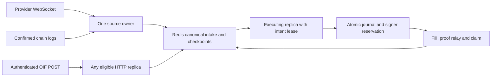

# Redis fleet remediation

The seven audit defects are fixed. The fleet still provides at-least-once intake
and fenced durable transitions; it does not claim exactly-once external effects
under arbitrary history loss. Configuration version 9 uses the explicitly chosen
persistent single-primary Redis profile and stops on an unapproved replacement.

| Audit finding | Current behavior | Regression evidence |
| --- | --- | --- |
| F1: pod exit withdraws another pod's quote | Each binding retains renewable ownership. Shutdown releases it; the next owner refreshes. Global pause requests withdrawal. | `TestClusterQuoteOwnerExitPreservesOfferAndTransfersOwnership` |
| F2: display name reuses a different contract's cursor | Cursor and ownership identity include the protocol, event, chain, settler and replay policy. A backfill change gets a separate cursor. | `TestClusterCheckpointsIdentifyTheSettler` |
| F3: fresh intake overtakes due settlement forever | Initial queue scores use Redis time, like subsequent transitions. New arrivals cannot indefinitely jump older due work. | `DueSettlementPrecedesNewIntake` backend contract |
| F4: 100 leased items hide free work | Workers inspect bounded pages until they claim work, exhaust due entries or reach their context deadline. Leases remain fenced and crash-recoverable. | `TestClusterLeasedHeadDoesNotHideRunnableQueueTail` uses 250 held leases |
| F5: dead engine remains ready | Startup validates publication mode; HTTP supervision propagates engine exits; both probes reflect engine lifecycle. | `TestServePropagatesEngineExit`, `TestProbesFollowEngineLifecycle` |
| F6: observation delays execution | Observation runs intake only. It starts neither execution workers nor signer recovery and cannot reschedule shared work. | `TestClusterObserverCannotDeferExecutingReplica` |
| F7: reconnect ignores Retry-After | The owner retains the source during backoff and waits at least the provider deadline, with bounded positive jitter. Cancellation interrupts the wait. | `TestSourceReconnectHonorsRetryAfterAndCancellation`, `TestStreamHandshakePreservesRetryAfter` |

The additional source-owner test covers graceful transfer between independent
Redis clients. Backend contract tests cover renewal during idle periods, forced
lease loss, and protection of a replacement owner's lease. Discovery accepts a
delivery only after canonical durable insertion. Duplicate OIF HTTP submissions,
WebSocket messages, and chain events converge on the same protocol-scoped record.

There is no LI.FI webhook adapter: the implemented provider contract is its
WebSocket plus bounded REST reconciliation. The inbound HTTP adapter implements
the OIF user-open endpoints. A future webhook needs its own verified wire schema,
authentication and retry contract; it must acknowledge only durable acceptance.

## Deployment resources

`deploy/kubernetes.yaml` keeps the example in observation mode. Its two replicas
use a zero-unavailable rolling update with one surge pod, a disruption budget,
and hostname/zone spread preferences. The ingress policy admits only same-namespace
pods labelled `goif-solver-access: "true"`. Apply that label to intended monitoring
or gateway pods, or review the selectors for a gateway in another namespace.
The policies require a CNI that enforces NetworkPolicy. HTTP remains an internal
ClusterIP service; a public OIF endpoint needs a separately configured TLS gateway.

`deploy/redis.yaml` supplies an optional single-primary StatefulSet, a retained
10 GiB PVC, internal TLS service, disruption budget, and solver-only ingress.
`OnDelete` prevents a Redis template edit from automatically restarting the
approved primary. A Redis restart is an outage until identity review and
reconciliation finish. Its disruption budget deliberately blocks routine node
draining until an operator performs that maintenance procedure.

Provide these resources through the cluster's configuration and secret manager:

| Resource | Required content |
| --- | --- |
| `goif-solver-config` ConfigMap | Reviewed `testnet.json`, with `listen: "0.0.0.0:8080"` |
| `goif-solver-secrets` Secret | Redis URL and approved run ID, control token, and only credentials needed by enabled adapters |
| `goif-redis-config` ConfigMap | `redis.conf` from `deploy/redis.conf` |
| `goif-redis-auth` Secret | `users.acl`, with anonymous access disabled and a password-protected solver user restricted as described in the recovery procedure |
| `goif-redis-tls` Secret | `tls.crt`, `tls.key`, `ca.crt`; the server certificate must cover the hostname in the Redis URL |

Use a `rediss://` URL with the ACL account and approved primary hostname. Only
the public CA is projected into solver pods; the Redis TLS private key is not.
The image retains its normal public CA bundle for RPC and provider HTTPS calls.
Supply a volume/storage class with the required fsync behavior and capacity;
the template's memory and disk sizes are starting bounds, not measured capacity.
Pin the solver image digest before deployment. No manifests are applied by the
quality gate, and no live cluster was contacted for this remediation.

## Monitoring and capacity

| Metric | Interpretation |
| --- | --- |
| `goif_queue_outstanding` | Shared nonterminal records, including delayed retries |
| `goif_queue_due` | Available entries whose scheduled time has passed; active leases are excluded |
| `goif_queue_oldest_due_seconds` | Age of the oldest available scheduling time |
| `goif_pending_signers` | Shared outstanding transaction reservations |
| `goif_oldest_pending_seconds` | Age since the oldest reservation was prepared; retries do not reset it |
| `goif_source_owners`, `goif_quote_owners` | Local renewable owners; sum across pods to compare with configured bindings |
| `goif_source_reconnects_total` | Local source exits that require reconnect; ownership contention is excluded |
| `goif_intents_discovered_total` | Local successful new durable insertions, including OIF intake; duplicates are excluded |

Queue and signer gauges describe the same namespace on every replica: aggregate
them with `max`, not `sum`. Use counter rates for process-local errors and progress.
Alert when due age rises without progress, a signer remains pending beyond its
chain's expected finality window, configured ownership is absent, or reconnects
remain elevated. An owner gauge proves ownership, not a connected provider or
up-to-date chain cursor. Readiness also does not attest to upstream RPC/proof health.

Request budgets remain per process and per configured endpoint. Account for all
replicas, the surge pod, and administrative callers when dividing an upstream
allowance. The example has no HPA: automatic scaling is not enabled without that
budget and workload analysis. More replicas do not increase a single account's
transaction throughput: each account/network retains one pending reservation
until verified finality. Independent configured signers can serve independent work.

Records, fence counters, transaction bytes and outcomes remain durable. Monitor
Redis memory, disk, AOF health and queue growth; keep headroom for transitions and
recovery. No TTL or eviction policy may discard authorization history. There is
no automatic archival/deletion job or aggregate capital reservation. Use bounded
route admission and capacity planning; do not describe fixed testnet quotes as a
production pricing or capital-allocation system.

Measure the complete Redis instance, including history: an empty work queue does
not imply low storage use. Collect `used_memory`, `used_memory_rss`, and
`maxmemory` from `INFO MEMORY`, and `aof_current_size`, `aof_base_size`,
`aof_last_write_status`, and `aof_last_bgrewrite_status` from `INFO PERSISTENCE`.
Monitor free bytes on the persistent volume separately. As initial operational
thresholds, alert at 70% of `maxmemory` and treat 85% as urgent; alert before free
disk falls below the observed AOF rewrite peak plus normal growth during operator
response. These are headroom policies, not measured production capacity limits.

Estimate the memory horizon from the measured increase in `used_memory` per
completed intent, including actual proof sizes, journals, and fence keys. Divide
the remaining memory below the 70% threshold by that increase and by the expected
completion rate. Repeat over a representative load window and budget disk from
the AOF measurements independently. Raise capacity or pause intake before the
forecast horizon reaches the response window. Keep enough headroom to finish
already accepted work. A capacity incident does not authorize history deletion,
`FLUSHDB`, eviction, or TTL changes. Archival needs a separate recovery design.

## Validation and remaining environment work

`bash scripts/check.sh` exercises both memory and isolated real Redis, runs all
tests and race checks, builds, vets, checks security/vulnerabilities, checks Lua,
validates the eight Kubernetes resources with strict pinned schemas, and runs
fresh/quick development smoke tests. The tests use synthetic credentials and
local RPC/HTTP fixtures. They neither load live keys nor send funded transactions.

Before deployment, the operator still supplies credentials/certificates, reviews
storage and provider capacity, approves the initial Redis identity, and performs
an actual rollout and restore rehearsal. The procedure is in
[Redis recovery](redis-recovery.md). A complete Redis rollback cannot be repaired
automatically from the same rolled-back state; this is why approval is external
and execution stops.

Primary deployment references:
https://kubernetes.io/docs/tasks/run-application/configure-pdb/,
https://kubernetes.io/docs/concepts/scheduling-eviction/topology-spread-constraints/,
https://kubernetes.io/docs/concepts/workloads/controllers/statefulset/.
